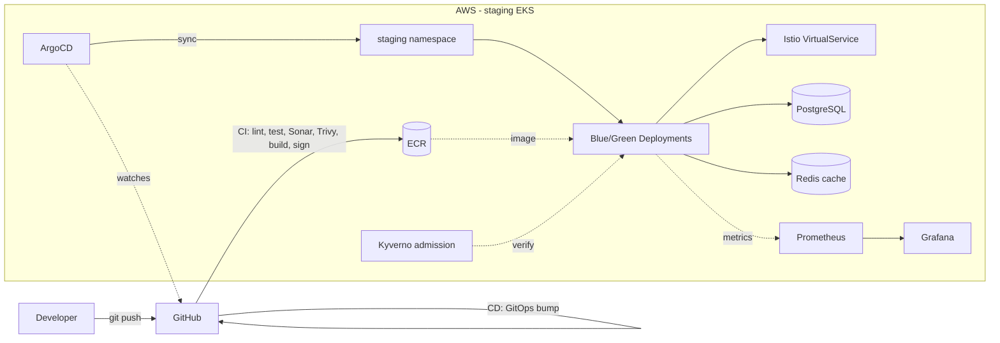

# DevSecOps Platform

<p align="center">
  <!-- Top Row -->
  
  
  
  
</p>
<p align="center">
  <!-- Bottom Row -->
  
  
  
  
  
</p>

> Production-grade DevSecOps platform on AWS using Kubernetes, Terraform, GitHub Actions, ArgoCD, Istio, SonarQube, Prometheus, Grafana and Loki.

The application is a **Feature Flag Service** — manage feature toggles per environment with Redis-cached reads and PostgreSQL audit logging. Similar to LaunchDarkly or Unleash, it serves as the demo workload for the full DevSecOps pipeline.

**For AI agents:** start with [AGENTS.md](AGENTS.md) and [STATUS.md](STATUS.md). Deploy issues: [TROUBLESHOOTING.md](TROUBLESHOOTING.md).

---

## Project Status

| Phase | Focus | Status |
|-------|-------|--------|
| 1 | AWS Infrastructure (Terraform) | Done |
| 2 | Kubernetes base (Minikube + Istio) | Done |
| 3 | Feature Flag Service + K8s manifests | **Done** |
| 4 | CI Pipeline (GitHub Actions, SonarCloud, ECR) | **Done** |
| 5 | CD Pipeline & GitOps (ArgoCD, staging-first) | **Implemented** — validate on EKS |
| 6 | Security hardening (Kyverno, Cosign, NetworkPolicy, External Secrets) | **Implemented** |
| 7 | Monitoring & SRE (Prometheus, Grafana, Loki, SLOs) | **Implemented** |
| 8 | DR & resilience (Velero, k6) | **Implemented** |
| 9 | Docs, ADRs, cost | **Implemented** |

All manifests/config/docs are committed. Live validation (EKS deploy + screenshots)
is the remaining step — staging is the only counted runtime; production is a Git
mirror that stays **off**. Full tracker: [STATUS.md](STATUS.md) · Roadmap: [PLAN.md](PLAN.md)

---

## Local Development

The same application can run in two **independent** ways. They are alternatives, not layers — pick one per session and do not run both at once (they compete for ports `3000`, `5432`, and `6379`).

| Mode | What runs | Best for |
|------|-----------|----------|
| **Docker Compose** | Three containers on your machine: postgres, redis, backend | Day-to-day API work, quick smoke tests, no Kubernetes needed |
| **Minikube (Kubernetes)** | Pods inside a local K8s cluster: postgres, redis, backend (+ Istio sidecar, HPA) | Testing `k8s/` manifests, Istio, HPA, and the Phase 3 deploy path |

`kubectl` does not run pods itself — it is the CLI that talks to the cluster. **Minikube** is the local Kubernetes cluster; pods live inside it.

### When to use Docker Compose

- Developing or debugging the NestJS API
- Running integration tests against a full stack without K8s overhead
- You only need `curl http://localhost:3000/health` and do not care about manifests

```bash
docker compose up --build          # start
curl http://localhost:3000/health
docker compose down                # stop (add -v to remove DB volumes)
```

Containers use `restart: unless-stopped`, so they may come back after a reboot if Docker Desktop is still running.

### When to use Minikube (Kubernetes)

- Validating Kustomize overlays under `k8s/overlays/dev/`
- Testing Istio sidecar injection, TCP routing, HPA, ResourceQuota, etc.
- Reproducing the deployment model used before EKS (staging/production)

Prerequisites: Minikube running, Istio injection enabled on the `dev` namespace. Full steps and gotchas: [k8s/README.md](k8s/README.md).

```bash
minikube start                                                     # once, or after minikube stop
kubectl apply -f k8s/namespaces/namespaces.yaml
docker build -t backend:latest ./app/backend
minikube image load backend:latest
kubectl apply -k k8s/overlays/dev
kubectl get pods -n dev
kubectl port-forward svc/backend -n dev 3000:80                    # separate terminal
curl http://localhost:3000/health
```

To tear down:

```bash
kubectl delete -k k8s/overlays/dev   # remove dev resources from the cluster
minikube stop                        # shut down the entire local cluster
```

### Optional: backend on the host (hot reload)

For the fastest edit-run loop, run only postgres and redis via Compose (or install them locally), then start the API with Bun:

```bash
docker compose up postgres redis -d
cd app/backend && bun run start:dev
```

See [app/backend/README.md](app/backend/README.md) for `.env` and Prisma setup.

---

## Architecture



Detailed diagrams (AWS infra, CI/CD flow, Kubernetes layout) and rationale:
[docs/architecture.md](docs/architecture.md). Decision records: [docs/adr/](docs/adr/).

---

## Tech Stack

| Layer | Tool |
|---|---|
| Application | NestJS 11, Bun, TypeScript, Prisma 7 |
| Data | PostgreSQL, Redis |
| Cloud | AWS (account `125156866917`) |
| IaC | Terraform |
| Containers | Docker |
| Orchestration | Kubernetes (Minikube dev / EKS staging+prod) |
| CI/CD | GitHub Actions (Phase 4) |
| GitOps | ArgoCD (Phase 5) |
| Service Mesh | Istio |
| Code Quality | SonarCloud |
| Security | Trivy, Checkov, Gitleaks, Cosign (Phases 4–6) |
| Monitoring | Prometheus, Grafana, Loki (Phase 7) |

---

## Repository Structure

```
app/backend/       NestJS Feature Flag API
infrastructure/    Terraform modules and environments
k8s/               Kustomize manifests (base + overlays)
images/phase-N/    Screenshot evidence per phase
docs/              Full documentation (Phase 9)
```

---

## Documentation

| Topic | Doc |
|-------|-----|
| Architecture & diagrams | [docs/architecture.md](docs/architecture.md), [docs/diagrams/](docs/diagrams/) |
| Deployment (Minikube + EKS) | [docs/deployment-guide.md](docs/deployment-guide.md), [k8s/README.md](k8s/README.md) |
| Security hardening | [docs/security.md](docs/security.md) |
| Monitoring & observability | [docs/monitoring.md](docs/monitoring.md), [monitoring/README.md](monitoring/README.md) |
| SRE — SLI/SLO/error budget | [docs/sre.md](docs/sre.md) |
| Disaster recovery | [docs/disaster-recovery.md](docs/disaster-recovery.md) |
| Resilience testing | [docs/resilience-testing.md](docs/resilience-testing.md) |
| SonarCloud quality gate | [docs/sonarqube.md](docs/sonarqube.md) |
| Cost estimates | [docs/cost.md](docs/cost.md) |
| Architecture Decision Records | [docs/adr/](docs/adr/) |

---

## Contributing

See [CONTRIBUTE.md](CONTRIBUTE.md) for branch strategy, commit conventions, and PR workflow.

---

## License

MIT
