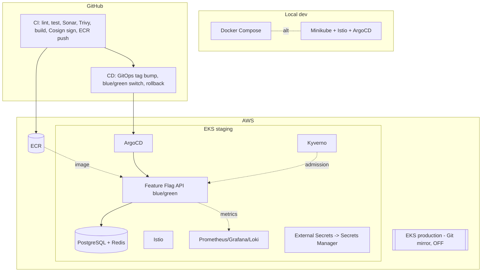
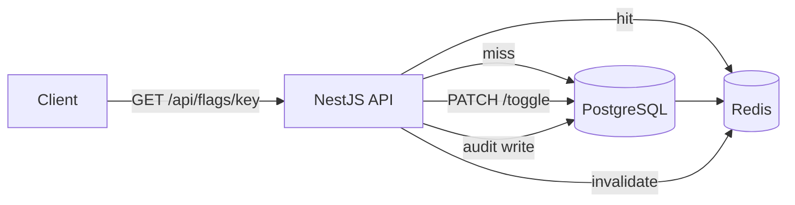
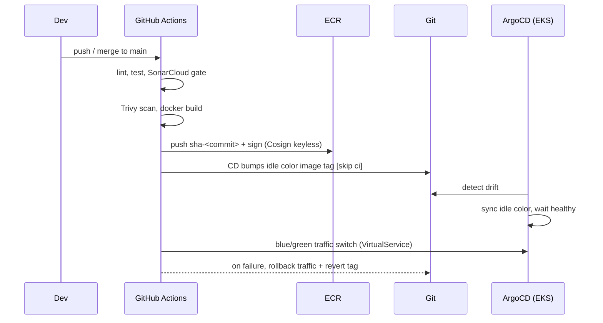

# Architecture

End-to-end design of the DevSecOps platform and its demo workload, the Feature
Flag Service. Diagram sources live in [diagrams/](diagrams/).

## System overview

## Environments

| Env | Cluster | Manifests | CD | Runtime |
|-----|---------|-----------|----|---------|
| dev | Minikube | `k8s/overlays/dev` | manual | local |
| staging | EKS | `k8s/overlays/staging` | automatic (ArgoCD) | **on** |
| production | EKS | `k8s/overlays/production` | deferred | **off** (Git mirror) |

One set of base manifests; per-environment differences are Kustomize overlays.

## Application (Feature Flag Service)

- **NestJS modules:** `flags`, `audit`, `health`, `cache`, `prisma`.
- **Redis** is the architectural core: flag reads happen on every client request,
  which is what justifies the HPA. Writes (toggles) are rare and invalidate cache.
- **PostgreSQL** is the source of truth for flag definitions + the audit log.
- Observability: `/metrics` (prom-client), structured JSON logs (pino) with
  request IDs, Istio mesh metrics/traces.

## CI/CD flow

## Security layers (Phase 6)

- **Build:** Trivy image scan, Cosign keyless signing.
- **Admission:** Kyverno (no privileged, resource limits, non-root, no `:latest`,
  hardened securityContext, verify Cosign signature).
- **Runtime:** Pod Security Standards (baseline enforce / restricted audit),
  hardened `securityContext`, NetworkPolicy default-deny, RBAC least-privilege.
- **Secrets:** External Secrets Operator + AWS Secrets Manager on EKS; local
  template on dev.

## Observability (Phase 7)

Prometheus scrapes app `/metrics` + Istio mesh + cluster; Grafana dashboards;
Loki/Promtail logs; SLOs with multi-window burn-rate alerts. See
[../docs/sre.md](sre.md) and [../monitoring/README.md](../monitoring/README.md).

## Resilience (Phase 8)

Velero backups (S3 + EBS snapshots), k6 load/HPA tests, documented failure-
injection drills. See [disaster-recovery.md](disaster-recovery.md) and
[resilience-testing.md](resilience-testing.md).

## Key decisions

See the ADRs in [adr/](adr/): ArgoCD over Flux, EKS over ECS, Kustomize for app /
Helm for infra, GitHub Actions over Jenkins, Istio trade-offs, and the
Feature-Flag-Service domain choice.
