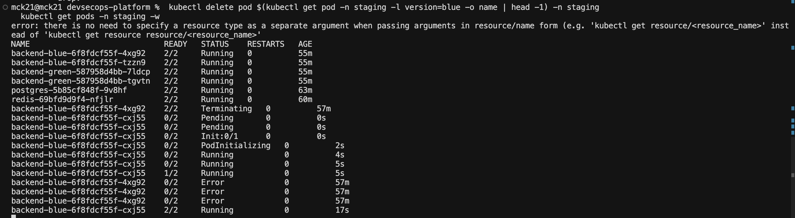

# Resilience Testing Runbook (Phase 8)

Failure-injection scenarios that prove the platform self-heals. Run on Minikube
first, then repeat the cluster-only tests on EKS. Helper:
[../scripts/resilience-test.sh](../scripts/resilience-test.sh); load:
[../tests/k6/](../tests/k6/).

## Scenarios

| # | Test | Method | Run on | Expected result |
|---|------|--------|--------|-----------------|
| 1 | Pod crash | `kubectl delete pod` | Minikube + EKS | ReplicaSet recreates pod; no 5xx (other replica serves) |
| 2 | Failed deployment | deploy broken image | Minikube + EKS | Probes fail → CD/ArgoCD rollback; traffic stays on healthy color |
| 3 | CPU stress | k6 `stress-hpa.js` | Minikube + EKS | HPA scales out to maxReplicas, then back in |
| 4 | Node drain | `kubectl drain` | EKS only | Pods rescheduled to other nodes |
| 5 | Secret rotation | rotate AWS secret | EKS only | External Secrets re-syncs `backend-secrets` within refresh interval |
| 6 | Namespace restore | Velero restore | EKS only | Namespace fully recovered (see disaster-recovery.md) |

## 1. Pod crash

```bash
scripts/resilience-test.sh pod-crash dev
# Expect: deleted pod replaced within seconds, READY count restored.
```

## 2. Failed deployment → rollback

```bash
scripts/resilience-test.sh bad-deploy dev backend
# Expect: rollout stuck (ImagePullBackOff / failing readiness).
kubectl rollout undo deployment/backend -n dev
```
On staging, the CD pipeline's health check fails and triggers
`scripts/rollback.sh` (blue/green traffic reverts to the previous color).

## 3. CPU stress → HPA scale-out

```bash
kubectl get hpa -n dev -w
BASE_URL=http://localhost:3000 k6 run tests/k6/stress-hpa.js
# Expect: current replicas climb toward maxReplicas (10) as CPU passes 70%,
# then scale back down after load stops (stabilization window).
```

## 4. Node drain (EKS)

```bash
kubectl get nodes
kubectl drain <node> --ignore-daemonsets --delete-emptydir-data
kubectl get pods -o wide -n staging   # pods rescheduled onto other nodes
kubectl uncordon <node>
```

## 5. Secret rotation (EKS)

```bash
aws secretsmanager put-secret-value \
  --secret-id mck21-devsecops/staging/backend \
  --secret-string '{"DATABASE_URL":"...","REDIS_URL":"..."}'
# Within refreshInterval (1h), ESO updates backend-secrets:
kubectl get externalsecret backend-secrets -n staging
kubectl rollout restart deployment/backend-blue -n staging   # pick up new value
```

## 6. Namespace restore (EKS)

See [disaster-recovery.md → Procedure 1](disaster-recovery.md#procedure-1--restore-a-namespace).

## Recorded results

The live drill was run on staging EKS before the AWS environment was
decommissioned — the deleted backend pod was recreated automatically with no
downtime. That evidence set is final; the drills above remain runnable on any
future cluster.


