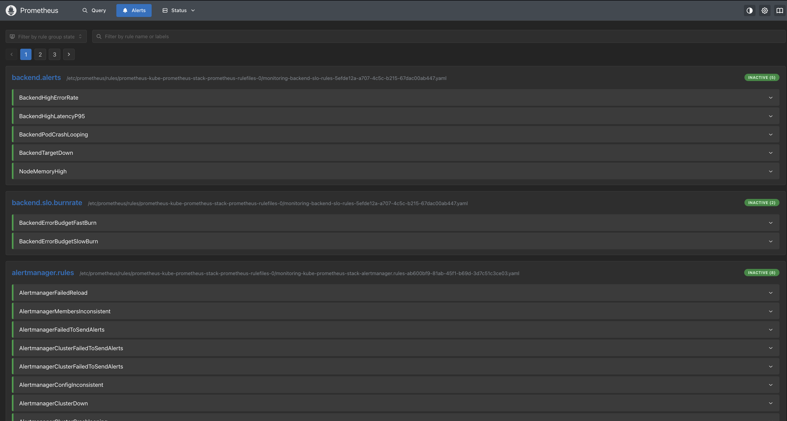

# SRE — SLIs, SLOs & Error Budget Policy

Reliability targets for the Feature Flag Service API. Measured from Istio mesh
telemetry (`reporter="destination"`) so they reflect the client experience.

## Service Level Indicators (SLIs)

| SLI | Definition | Source metric |
|-----|------------|---------------|
| Availability | % of requests returning non-5xx | `istio_requests_total` (response_code) |
| Latency | P95 of `GET /api/flags/{key}` (Redis-cached read) | `istio_request_duration_milliseconds_bucket` |
| Error rate | % of requests returning 5xx | `istio_requests_total` (response_code=~"5..") |

## Service Level Objectives (SLOs)

| SLO | Target | Window |
|-----|--------|--------|
| API availability | 99.9% | 30 days rolling |
| P95 latency | ≤ 300 ms | 30 days rolling |
| Error rate | < 0.1% | 30 days rolling |

**Error budget:** 99.9% availability ⇒ **0.1%** of requests may fail per 30-day
window (~43 min of full downtime equivalent).

## Error Budget Policy

- **Budget healthy (>50% remaining):** normal feature velocity; deploys flow
  through CI/CD freely.
- **Budget low (<50% remaining):** prioritise reliability work; non-critical
  risky changes held.
- **Budget exhausted:** change freeze except reliability/security fixes until the
  budget recovers over the rolling window.

## Burn-rate alerting (multi-window, multi-burn-rate)

Implemented in [../monitoring/prometheus/prometheusrules.yaml](../monitoring/prometheus/prometheusrules.yaml).

| Alert | Condition | Severity | Action |
|-------|-----------|----------|--------|
| `BackendErrorBudgetFastBurn` | 14.4× budget over 1h **and** 5m | critical | Page on-call |
| `BackendErrorBudgetSlowBurn` | 6× budget over 6h **and** 30m | warning | Create ticket |
| `BackendHighErrorRate` | 5xx ratio > 5% for 5m | critical | Page |
| `BackendHighLatencyP95` | P95 > 300 ms for 10m | warning | Investigate |
| `BackendPodCrashLooping` | >3 restarts / 15m | critical | Page |
| `NodeMemoryHigh` | node mem > 85% for 10m | warning | Investigate |

Why two burn rates: a **fast burn** (14.4×) catches acute outages within minutes;
a **slow burn** (6×) catches gradual degradation before it silently drains the
monthly budget. Each alert requires a long **and** a short window to fire, which
suppresses flapping from brief spikes.

Rules loaded on the live staging Prometheus:

## Dashboards

- **SLO — Error Budget** (`slo-error-budget`): availability vs target, budget
  remaining gauge, current burn rate, multi-window error ratio.
- **Feature Flag Service** (`feature-flags-app`): request rate, error ratio, P95,
  cache hit ratio, HPA replicas.

## Reviewing the budget

Monthly SRE review: read the SLO dashboard, classify any incidents, and decide
feature-vs-reliability priority for the next period per the policy above.
