# Build This Platform — Step by Step

A hands-on walkthrough to rebuild the whole platform from an empty AWS account
to a working GitOps pipeline with security policies, monitoring, and disaster
recovery. Each step matches a project phase and shows **real evidence** captured
while this pipeline ran live.

> **How to read this guide.** Commands are copy-pasteable and assume the repo
> root as working directory. Screenshots show the expected outcome of each step —
> if your output looks like the image, you're on track. When something breaks,
> jump to [TROUBLESHOOTING.md](../TROUBLESHOOTING.md) before debugging blind.

## Contents

1. [Prerequisites](#0--prerequisites)
2. [AWS foundations with Terraform](#1--aws-foundations-with-terraform)
3. [Kubernetes base: Minikube, ArgoCD, Istio](#2--kubernetes-base-minikube-argocd-istio)
4. [The application: Feature Flag Service](#3--the-application-feature-flag-service)
5. [CI pipeline](#4--ci-pipeline)
6. [CD & GitOps: blue/green on EKS](#5--cd--gitops-bluegreen-on-eks)
7. [Security hardening](#6--security-hardening)
8. [Monitoring & SRE](#7--monitoring--sre)
9. [Disaster recovery & resilience](#8--disaster-recovery--resilience)
10. [Documentation & cost](#9--documentation--cost)
11. [Teardown](#teardown)

---

## 0 · Prerequisites

| Tool | Used for |
|------|----------|
| `terraform` ≥ 1.5 | AWS infrastructure |
| `aws` CLI v2 | Account access, EKS kubeconfig |
| `kubectl` | Talking to clusters |
| `minikube` | Local dev cluster |
| `istioctl` | Service mesh install |
| `helm` | ArgoCD, monitoring, Kyverno, Velero |
| `docker` + Docker Compose | Local app stack, image builds |
| `bun` | Backend runtime/tooling (NestJS) |
| `gh` (optional) | Watching Actions runs from the terminal |

You also need an AWS account with admin access for the initial Terraform run,
and a GitHub repository (fork or clone of this one) for the CI/CD phases.

---

## 1 · AWS foundations with Terraform

**Goal:** VPC, EKS cluster, ECR registry, and IAM roles — all reproducible from
`infrastructure/`.

### 1.1 Remote state first

Terraform state must live somewhere durable *before* any real infrastructure
exists. Create the S3 state bucket (plus a lock mechanism) once:

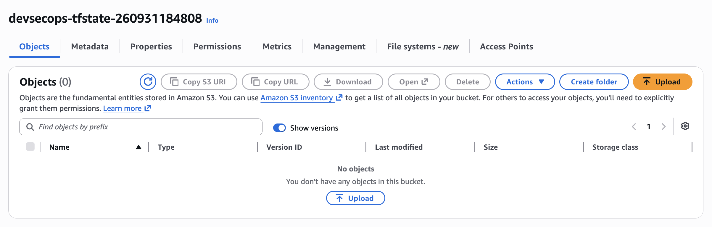

Enable versioning and state locking so concurrent applies can't corrupt state
and any bad apply can be rolled back to a previous state version:

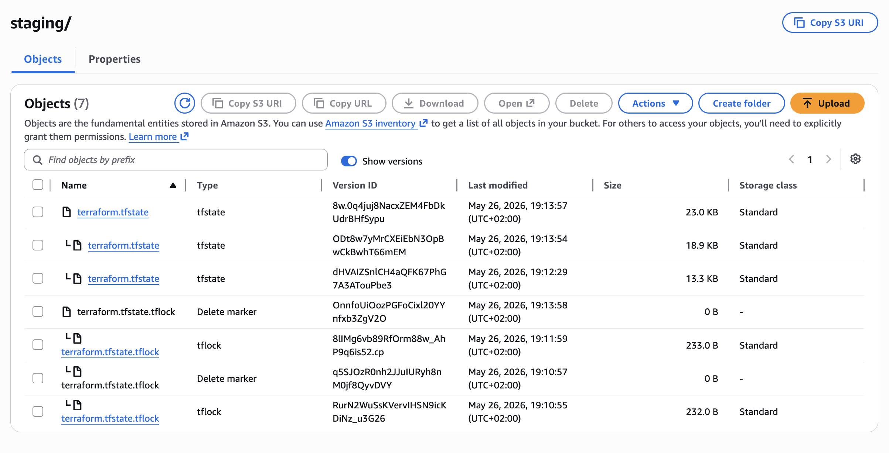

### 1.2 Apply the network + cluster

The modules under `infrastructure/modules/` (vpc, eks, ecr, iam,
security-groups) are composed per environment:

```bash
cd infrastructure/environments/staging
terraform init
terraform plan     # review before applying
terraform apply
```

The VPC spans multiple AZs with public subnets (load balancers) and private
subnets (worker nodes):

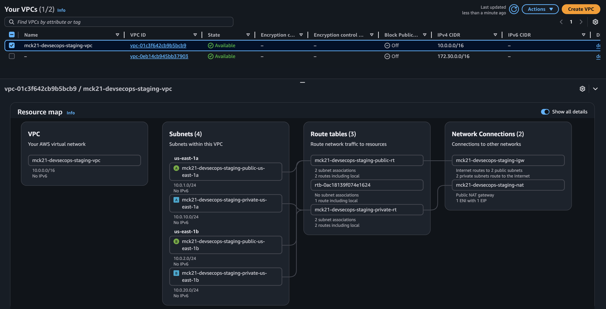

IAM roles are created for the cluster, node groups, and the CI/CD principal —
no long-lived user keys:

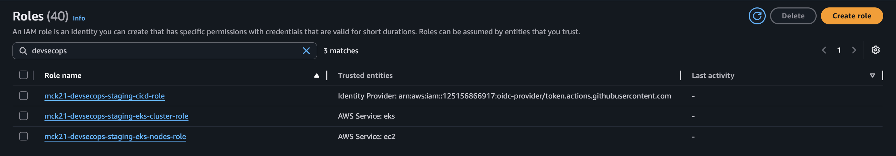

Security groups restrict traffic between the control plane, nodes, and load
balancers:

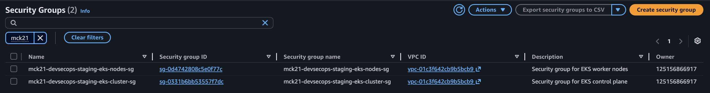

### 1.3 Verify the cluster

When the apply finishes, the EKS cluster is active:

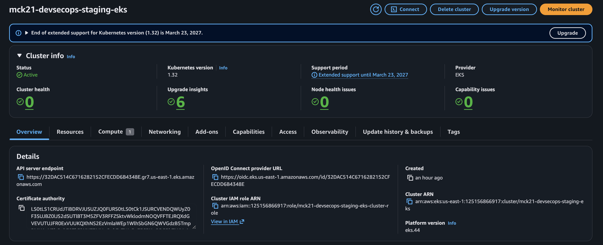

with its managed node group of EC2 workers:

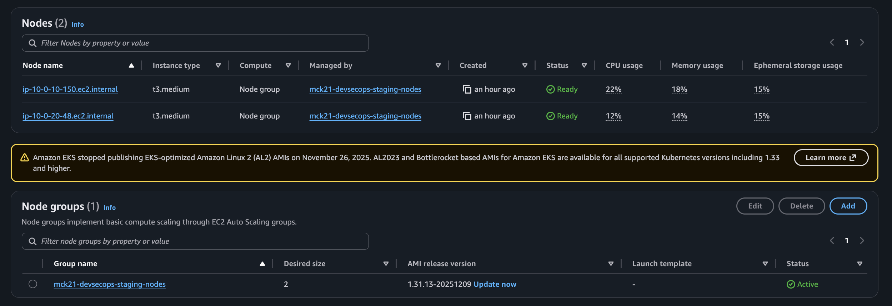

Point `kubectl` at it and confirm the system pods and nodes are healthy:

```bash
aws eks update-kubeconfig --name mck21-devsecops-staging-eks --region us-east-1
kubectl get pods -n kube-system
kubectl get nodes
```

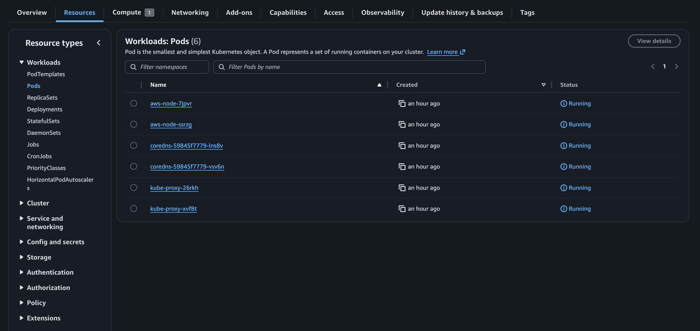

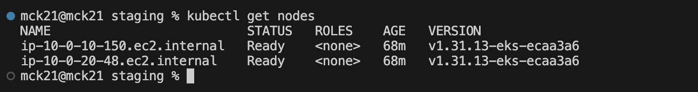

### 1.4 Container registry

ECR is created with **scan-on-push** enabled, so every image is vulnerability
scanned the moment CI pushes it:

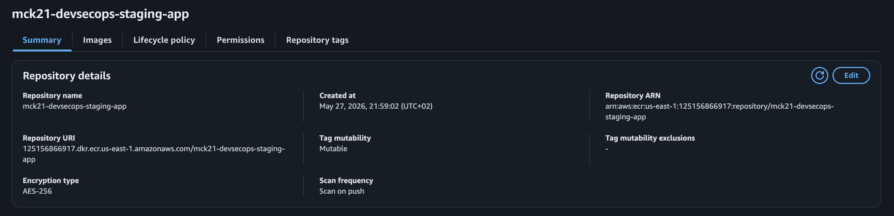

### 1.5 Staging environment

The same modules produce the dedicated **staging** cluster used by the CD
pipeline later in this guide:

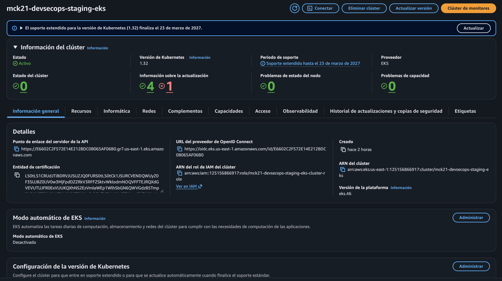

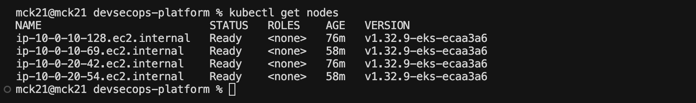

> **Checkpoint:** `terraform apply` is clean, `kubectl get nodes` shows Ready
> nodes, ECR exists with scan-on-push. Cost note: an idle EKS cluster bills
> ~$73/month for the control plane alone — see [cost.md](cost.md) and tear down
> when not in use.

---

## 2 · Kubernetes base: Minikube, ArgoCD, Istio

**Goal:** a free local cluster that mirrors the platform layout — namespaces,
GitOps controller, and service mesh — before spending anything on AWS runtime.

### 2.1 Local cluster

```bash
minikube start --cpus=4 --memory=8192 --driver=docker
minikube addons enable ingress
minikube addons enable metrics-server
```

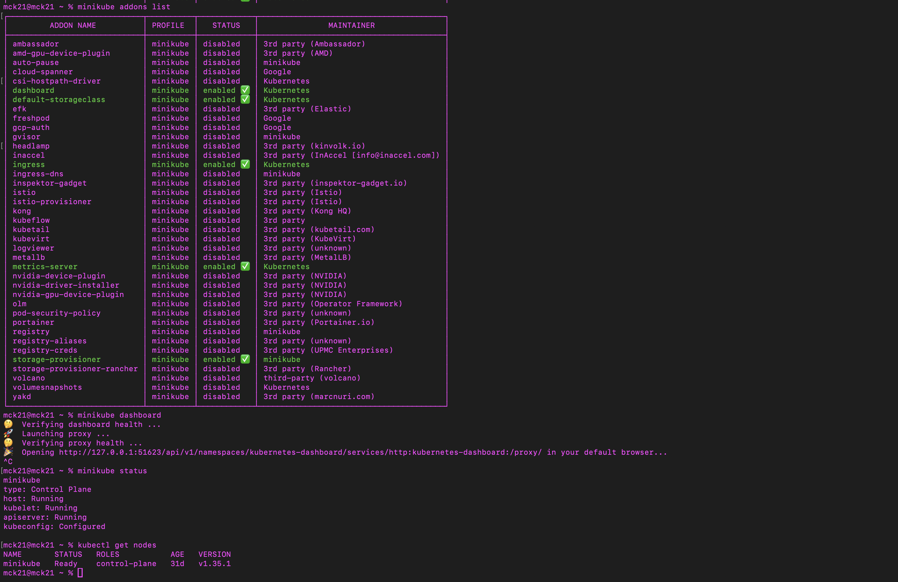

Create the platform namespaces (`dev`, `staging`, `production`, plus system
namespaces) with their Pod Security labels:

```bash
kubectl apply -f k8s/namespaces/namespaces.yaml
```

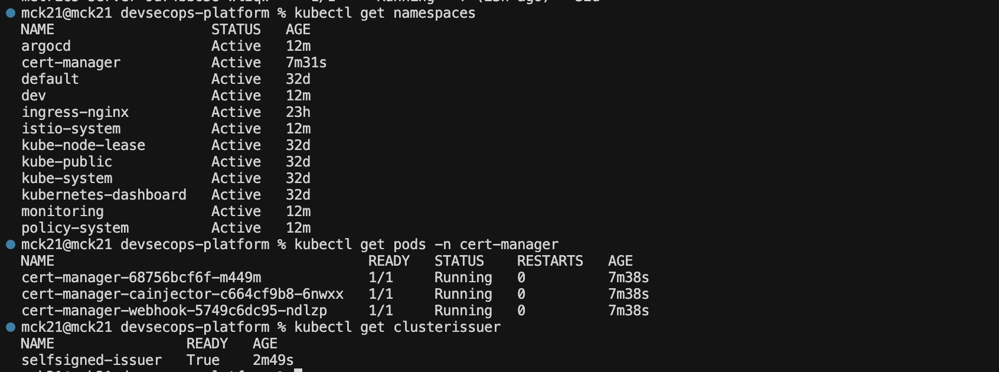

### 2.2 ArgoCD

Install the GitOps controller — everything deployed to staging later goes
through it, never `kubectl apply` by hand:

```bash
kubectl apply -n argocd -f https://raw.githubusercontent.com/argoproj/argo-cd/stable/manifests/install.yaml
kubectl port-forward svc/argocd-server -n argocd 8080:443
```

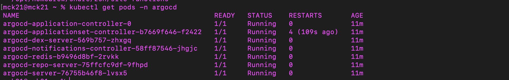

Log in at `https://localhost:8080` (user `admin`, password from the
`argocd-initial-admin-secret` secret):

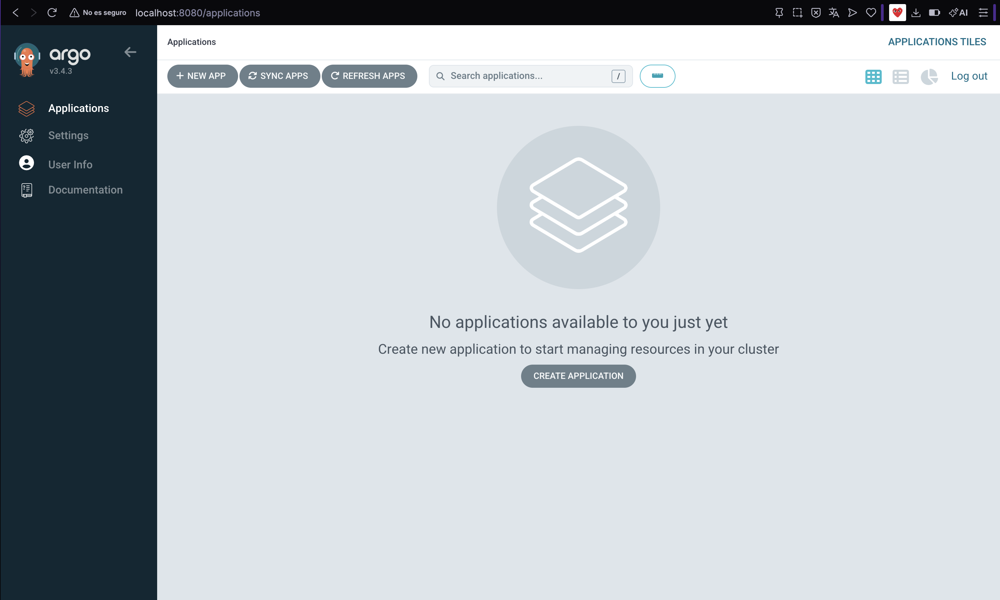

### 2.3 Istio service mesh

Istio provides mTLS, traffic splitting (the mechanism behind blue/green in
step 5), and the mesh metrics that power the SLOs in step 7. Use the `demo`
profile locally:

```bash
istioctl install --set profile=demo -y
kubectl label namespace dev istio-injection=enabled --overwrite
```

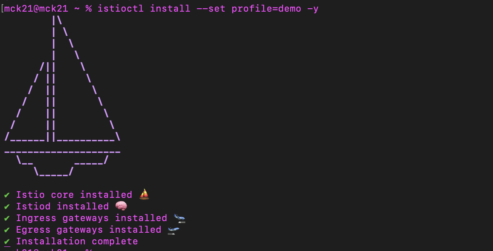

Add the observability addons (Kiali, Jaeger, Prometheus):

```bash
kubectl apply -f https://raw.githubusercontent.com/istio/istio/release-1.24/samples/addons/kiali.yaml
kubectl apply -f https://raw.githubusercontent.com/istio/istio/release-1.24/samples/addons/jaeger.yaml
kubectl apply -f https://raw.githubusercontent.com/istio/istio/release-1.24/samples/addons/prometheus.yaml
```

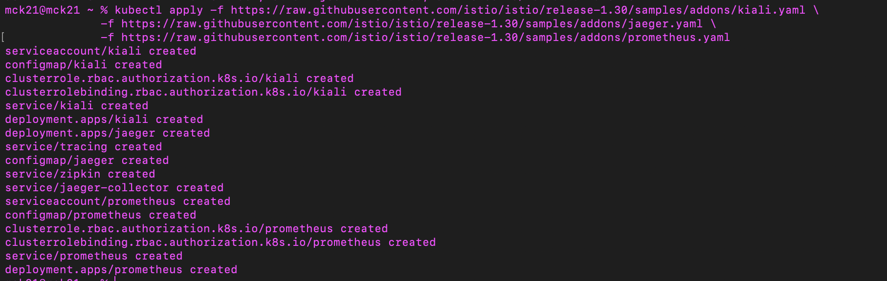

Kiali visualizes the mesh topology and live traffic:

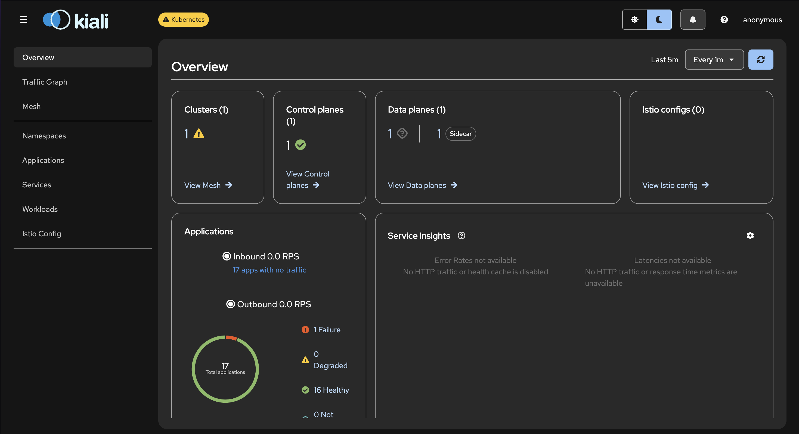

Jaeger traces requests across the sidecar proxies:

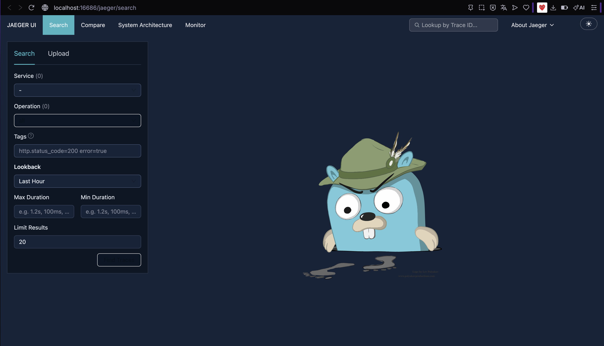

> **Checkpoint:** ArgoCD UI reachable, `istioctl verify-install` clean, Kiali
> shows the mesh. Gotcha: Istio needs LimitRange minimums of `10m` CPU / `40Mi`
> memory or sidecar injection fails — see
> [TROUBLESHOOTING.md](../TROUBLESHOOTING.md).

---

## 3 · The application: Feature Flag Service

**Goal:** the demo workload — a NestJS API managing feature flags with
Redis-cached reads and a PostgreSQL audit trail. Flags are written rarely but
read on every client request; that read path is what justifies caching and HPA.

### 3.1 Run it with Docker Compose

The fastest way to see the app working — three containers, no Kubernetes:

```bash
docker compose up --build
```

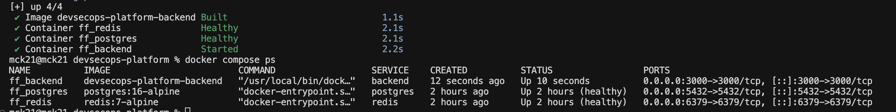

### 3.2 Exercise the API

Create a flag:

```bash
curl -X POST http://localhost:3000/api/flags \
  -H 'Content-Type: application/json' \
  -d '{"key":"dark-mode","name":"Dark mode","environments":{"dev":true}}'
```

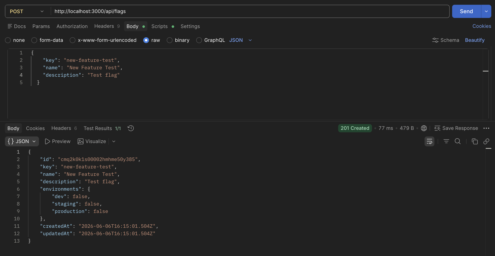

Toggle it per environment — this invalidates the Redis cache entry:

```bash
curl -X PATCH http://localhost:3000/api/flags/dark-mode/toggle \
  -H 'Content-Type: application/json' -d '{"environment":"dev"}'
```

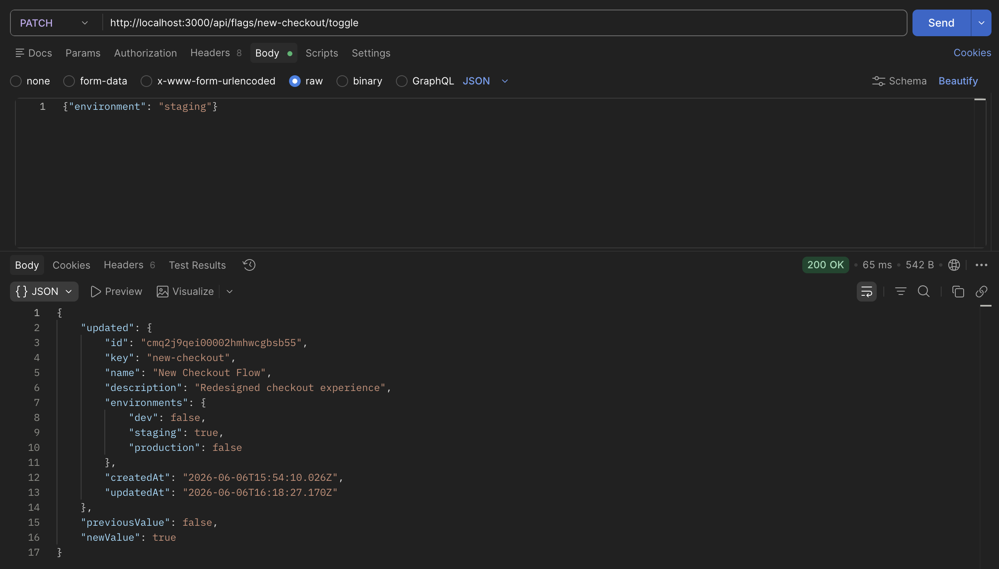

Every create/toggle/delete is written to the audit log:

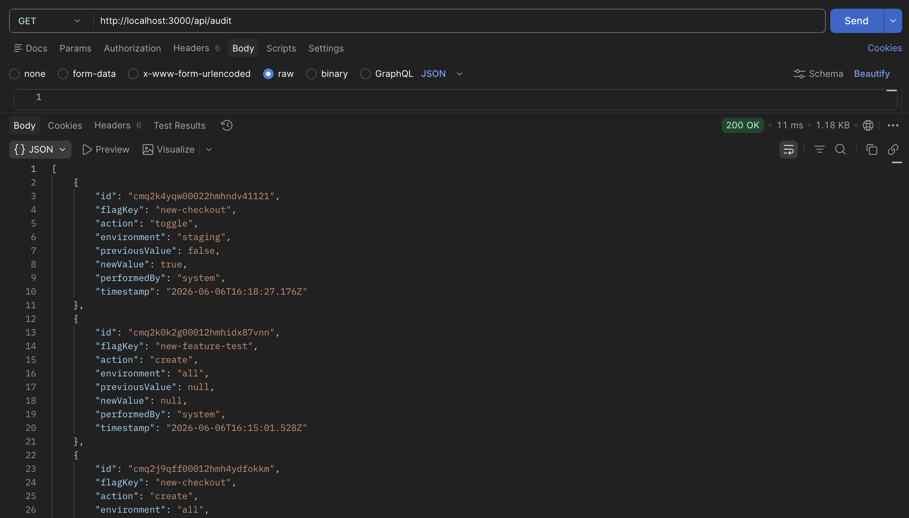

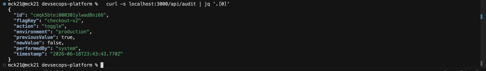

The app also exposes what the platform needs: Prometheus metrics and a health
endpoint that checks PostgreSQL and Redis connectivity:

```bash
curl http://localhost:3000/metrics
curl http://localhost:3000/health
```

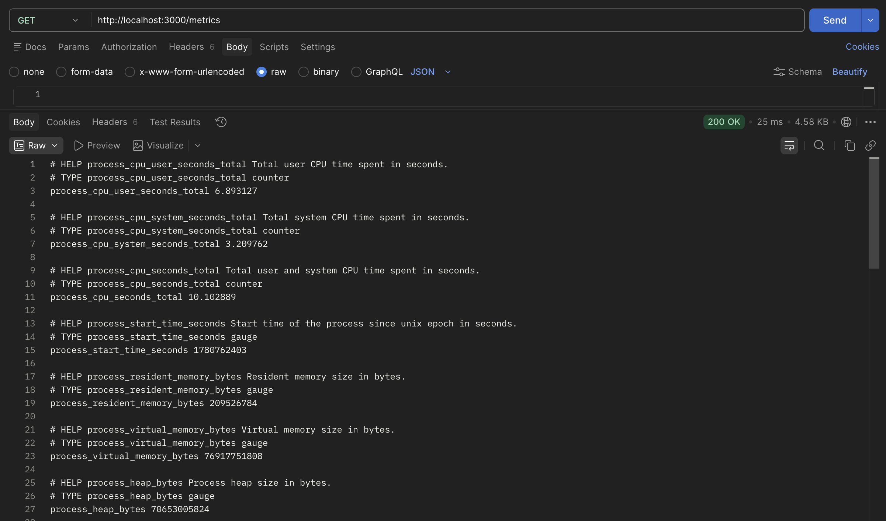

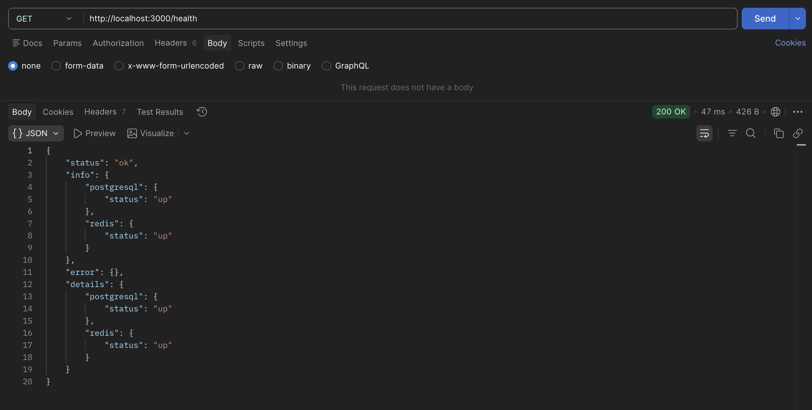

### 3.3 Deploy to Kubernetes (dev overlay)

The manifests are Kustomize: an env-agnostic `k8s/base/` plus per-environment
overlays. Deploy the dev overlay to Minikube:

```bash
docker build -t backend:latest ./app/backend
minikube image load backend:latest
kubectl apply -f k8s/base/secret.yaml -n dev     # local template only
kubectl apply -k k8s/overlays/dev
kubectl get pods -n dev
```

All pods run `2/2` — the app container plus its Istio sidecar:

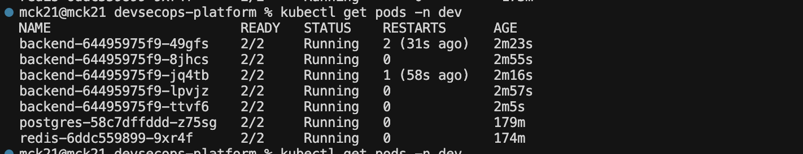

Under load, the HPA scales the backend while LimitRange and ResourceQuota keep
the namespace within bounds:

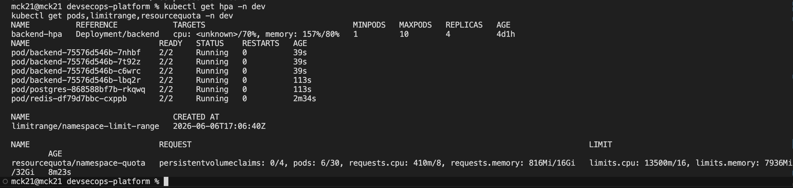

The same manifests later run on EKS via the staging overlay:

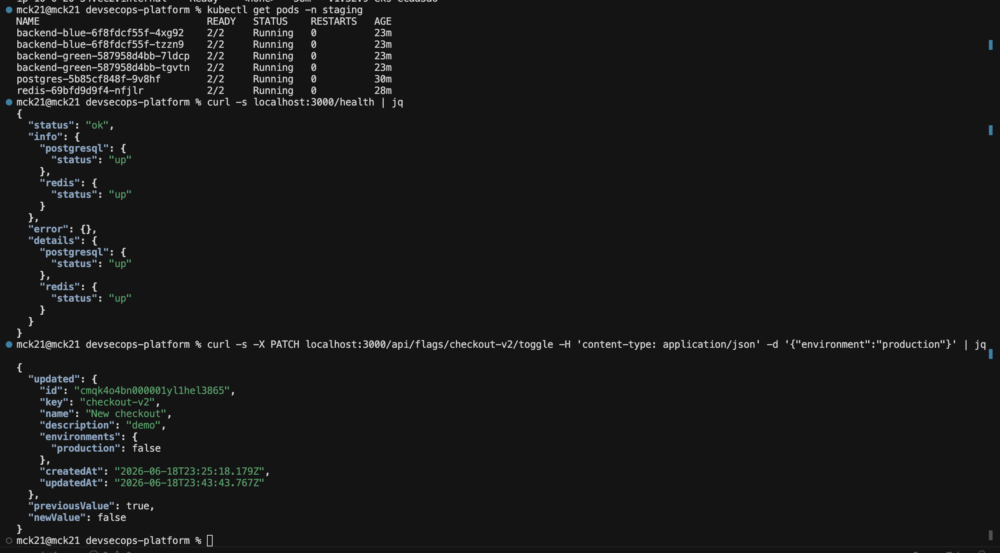

> **Checkpoint:** API answers on Compose *and* on Minikube; pods are `2/2`;
> HPA reacts to load. The Istio+TCP gotchas (postgres/redis port naming,
> DestinationRules, `holdApplicationUntilProxyStarts`) are the most common
> failure here — [TROUBLESHOOTING.md](../TROUBLESHOOTING.md) covers all of them.

---

## 4 · CI pipeline

**Goal:** every push is linted, tested, quality-gated, scanned, and — on `main`
— built, signed, and pushed to ECR. Defined in
[`.github/workflows/ci.yaml`](../.github/workflows/ci.yaml).

| Job | What it does |
|-----|--------------|
| **Lint** | ESLint (backend), yamllint (manifests), `terraform fmt -check` |
| **Unit Tests** | Jest with coverage (Bun), coverage artifact for Sonar |
| **Build, Scan & Push** | Docker build → Trivy image scan → push `sha-<commit>` to staging ECR → **Cosign keyless sign** |

Supporting pieces:

- **SonarCloud** enforces a Quality Gate on every PR via the GitHub App — setup
  and rules in [sonarqube.md](sonarqube.md).
- Images are tagged with the immutable `sha-<commit>` (never `:latest`), which
  Kyverno later enforces at admission.
- The Cosign signature is recorded in the Rekor transparency log and verified
  at admission in step 6 — unsigned images can't run in staging.

There are no screenshots for this phase — the evidence is the pipeline itself:
green runs in the repo's **Actions** tab and the SonarCloud dashboard.

> **Checkpoint:** a PR shows Lint + Unit Tests + Sonar Quality Gate checks; a
> merge to `main` additionally pushes a signed image to ECR.

---

## 5 · CD & GitOps: blue/green on EKS

**Goal:** merging to `main` deploys to staging EKS with zero-downtime blue/green
switching — and Git, not a human, is the source of truth for what runs.

### 5.1 Bootstrap the staging cluster (one-time)

Follow [`k8s/argocd/install-notes.md`](../k8s/argocd/install-notes.md): Istio
(production profile), Ingress NGINX, cert-manager, `backend-secrets`, ArgoCD via
Helm, repo connection, then:

```bash
kubectl apply -f k8s/argocd/application-staging.yaml
```

Set the GitHub repo variables `EKS_CLUSTER_NAME` and (optionally)
`STAGING_HEALTH_URL`.

### 5.2 How a deploy flows

Defined in [`.github/workflows/cd.yaml`](../.github/workflows/cd.yaml) +
[`scripts/`](../scripts/):

1. **Gate** — runs only if CI succeeded on `main`.
2. **GitOps bump** — `gitops-bump.sh` edits the *idle* color's image tag in
   `k8s/overlays/staging/` and pushes a `[skip ci]` commit. Git now describes
   the desired state.
3. **Sync** — ArgoCD detects the drift and rolls out the idle color.

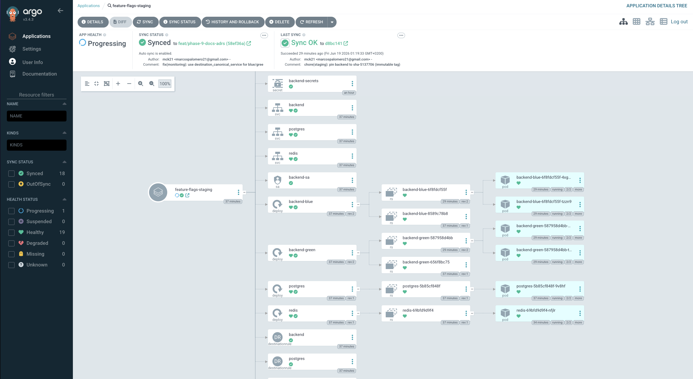

4. **Health check** — `blue-green-health.sh` waits for the rollout and probes
   `/health` through the mesh.
5. **Traffic switch** — `blue-green-switch.sh` flips the Istio VirtualService
   weights (100/0) to the new color. The old color stays warm for instant
   rollback:

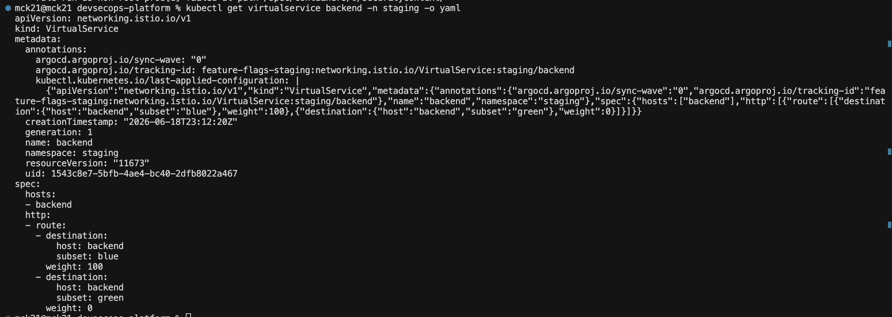

6. **Rollback** — any failure reverts the traffic weights and the Git tag bump
   automatically (`rollback.sh`).

### 5.3 Trigger it

```bash
git checkout main && git pull
git commit --allow-empty -m "chore: trigger staging deploy"
git push origin main
gh run list --workflow=CD --limit 3
```

> **Checkpoint:** CD run green; `kubectl get virtualservice backend -n staging
> -o yaml` shows 100/0 toward the new color; ArgoCD app **Synced + Healthy**.
> Production stays a Git mirror — see
> [showcase-staging-only.md](showcase-staging-only.md).

---

## 6 · Security hardening

**Goal:** defense-in-depth — nothing unsigned, privileged, or unbounded gets
admitted, and workloads run least-privilege. Full detail: [security.md](security.md).

### 6.1 Admission control — Kyverno

```bash
helm install kyverno kyverno/kyverno -n policy-system --create-namespace
kubectl apply -k k8s/kyverno/policies
```

Six ClusterPolicies enforce: no privileged containers, resource limits
required, non-root, no `:latest` tags, hardened securityContext, and **Cosign
signature verification** (the CI signature from step 4 is checked here).
Try to deploy a privileged pod and Kyverno blocks it:

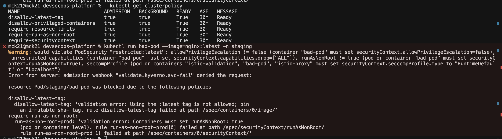

### 6.2 Network isolation + RBAC

```bash
kubectl apply -k k8s/security
```

Default-deny ingress per namespace with explicit allows (ingress → backend,
backend → postgres/redis, monitoring scrapes), plus least-privilege RBAC roles:

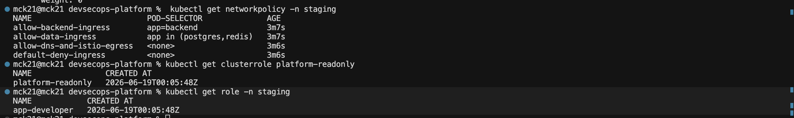

### 6.3 Workload hardening

The backend runs non-root (uid 1001), read-only root filesystem, all
capabilities dropped, seccomp `RuntimeDefault`, no service account token:

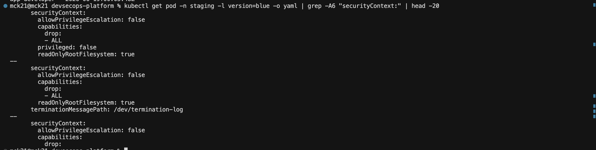

### 6.4 Secrets

On EKS, secrets come from AWS Secrets Manager via External Secrets Operator
(IRSA) — nothing sensitive in Git. Locally, `k8s/base/secret.yaml` is a
placeholder template only.

> **Checkpoint:** a privileged/unsigned/`:latest` pod is rejected at admission;
> `kubectl exec` into the backend shows uid 1001 and a read-only filesystem.

---

## 7 · Monitoring & SRE

**Goal:** metrics, logs, dashboards, and SLO-based alerting. Operational guide:
[`monitoring/README.md`](../monitoring/README.md) · concepts: [monitoring.md](monitoring.md) · SLOs: [sre.md](sre.md).

### 7.1 Install the stack

```bash
helm install kube-prometheus-stack prometheus-community/kube-prometheus-stack \
  -n monitoring --create-namespace -f monitoring/prometheus/values-eks.yaml   # or values-dev.yaml
helm install loki grafana/loki -n monitoring -f monitoring/loki/values-eks.yaml
helm install promtail grafana/promtail -n monitoring -f monitoring/promtail/values.yaml
kubectl apply -k monitoring        # ServiceMonitor + SLO rules + dashboards
```

### 7.2 Verify scraping

Prometheus scrapes three sources: the app's `/metrics` (ServiceMonitor), Istio
mesh telemetry (the basis for SLOs), and cluster metrics
(node-exporter/kube-state-metrics). All targets must be **UP**:

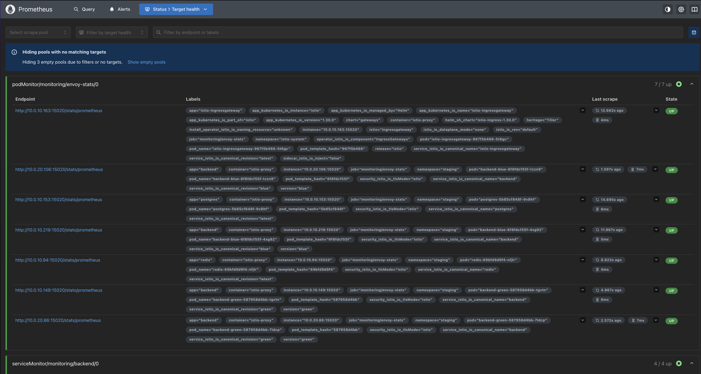

### 7.3 Dashboards

Custom Grafana dashboards (provisioned as ConfigMaps, auto-imported by the
sidecar) show request rate, latency, cache hit ratio, and error budget:

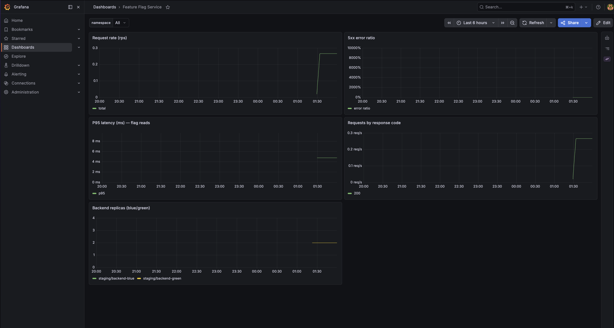

### 7.4 SLO alerts

Multi-window burn-rate rules (from [sre.md](sre.md): 99.9% availability,
p95 ≤ 300 ms) fire before the error budget is gone, not after:


> **Checkpoint:** all Prometheus targets UP, the app dashboard renders live
> data, `ALERTS` shows the burn-rate rules loaded. Blue/green note: mesh
> queries use `destination_canonical_service` so both colors count as one
> service.

---

## 8 · Disaster recovery & resilience

**Goal:** prove the platform survives pod, node, and data loss. Runbooks:
[disaster-recovery.md](disaster-recovery.md) · [resilience-testing.md](resilience-testing.md).

### 8.1 Backups — Velero

```bash
helm install velero vmware-tanzu/velero -n velero --create-namespace   # see k8s/velero/install-notes.md
kubectl apply -f k8s/velero/schedules.yaml
```

Scheduled backups cover cluster resources + EBS snapshots to S3, with restore
procedures per scenario in [disaster-recovery.md](disaster-recovery.md).

### 8.2 Failure injection

`scripts/resilience-test.sh` automates the drills; [`tests/k6/`](../tests/k6/)
provides load. The core proof — kill the backend pod and watch Kubernetes
recreate it while the service keeps answering:

```bash
kubectl delete pod -l app=backend -n staging   # then watch it self-heal
```


Other drills in the runbook: HPA under k6 load, database restart, ArgoCD
drift correction, and namespace restore from Velero.

> **Checkpoint:** deleted pods return with zero failed requests during the
> window; a Velero restore brings a deleted namespace back.

---

## 9 · Documentation & cost

Everything you're reading is Phase 9:

- [architecture.md](architecture.md) — system, app, and CI/CD diagrams
- [adr/](adr/) — why ArgoCD over Flux, EKS over ECS, Kustomize + Helm split, …
- [cost.md](cost.md) — monthly estimates per environment
- [diagrams/](diagrams/) — Mermaid sources (GitHub renders them inline)

---

## Teardown

EKS bills by the hour. When you're done:

```bash
# Remove Helm releases and app namespaces first (ALB/EBS cleanup), then:
cd infrastructure/environments/staging
terraform destroy
minikube delete    # local
```

The original AWS environment for this repo was validated live and then
decommissioned — the screenshots above are the captured evidence of the
working pipeline.
